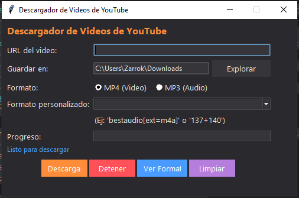

# YouTube Video Downloader

The **YouTube Video Downloader** is a cross-platform desktop application that provides a graphical user interface (GUI) for downloading videos and audio from YouTube. Built with the Tkinter library and utilizing yt-dlp for media retrieval citeturn1search0, this application simplifies the process of obtaining YouTube content without requiring command-line expertise.

## Quick Start

### Prerequisites

- **Python 3.8 or later** must be installed on your system.
- **yt-dlp** will be installed automatically by the application if not already present. Alternatively, you may install it manually:

  ```bash
  pip install yt-dlp
  ```
  citeturn1search0

- **ffmpeg** is recommended for merging separate video and audio streams into a single file. It can be installed via your platform’s package manager:
  - **Linux (Debian/Ubuntu)**:
    ```bash
    sudo apt update
    sudo apt install ffmpeg
    ```
  - **macOS (Homebrew)**:
    ```bash
    brew install ffmpeg
    ```
  - **Windows**: Download and install from the [official ffmpeg website](https://ffmpeg.org/) and ensure the executable is available in your `PATH`.

### Clone the Repository

Clone the project from GitHub:

```bash
git clone https://github.com/foxxfiles/YouTubeVideoDownloader.git
cd YouTubeVideoDownloader
```

### Setting Up a Virtual Environment

It is recommended to use a virtual environment to isolate dependencies.

- **Linux/macOS**:
  ```bash
  python3 -m venv venv
  source venv/bin/activate
  pip install -r requirements.txt
  ```
- **Windows (PowerShell)**:
  ```powershell
  python -m venv venv
  .\venv\Scripts\activate
  pip install -r requirements.txt
  ```
  Ensure `requirements.txt` includes:
  ```text
  yt-dlp
  ```

### Running the Application

Once dependencies are installed, launch the GUI:

```bash
python ytd.py
```

The main window will appear, allowing you to enter a YouTube URL, choose download options, and initiate the retrieval process.

## Usage Guide


### Entering a Video URL

1. **URL Field**: Enter the full YouTube video URL (e.g., `https://www.youtube.com/watch?v=xxxxxxxxxxx`).
2. **Save Directory**: By default, the application uses your system’s `Downloads` folder. To change, click **Browse** and select a new folder.
3. **Format Selection**:
   - Choose between **MP4 (Video)** or **MP3 (Audio)** by selecting the corresponding radio button.
   - To select a specific format or quality, click **View Formats**. This retrieves available media streams via yt-dlp and displays them in a dropdown. Selecting an entry populates the **Custom Format** field with the appropriate format code (e.g., `137+140` for 1080p video + high-quality audio) citeturn1search3.
4. **Download**:
   - Click **Download** to start the retrieval process. The status bar will display real-time output from yt-dlp, and the progress bar indicates completion percentage.
   - If downloading an MP3, the application downloads the best M4A audio and renames it to `.mp3`.
   - If combining separate streams, ffmpeg is invoked to merge video and audio into a single MP4 container.
5. **Stop**:
   - At any point, click **Stop** to terminate the ongoing download. Any incomplete files will be cleaned up automatically.
6. **Clear**:
   - Click **Clear** to reset all fields and progress indicators to their default state.

## Footer

For additional tutorials and updates, visit our YouTube channel:

**https://www.youtube.com/@efoxxfiles**

